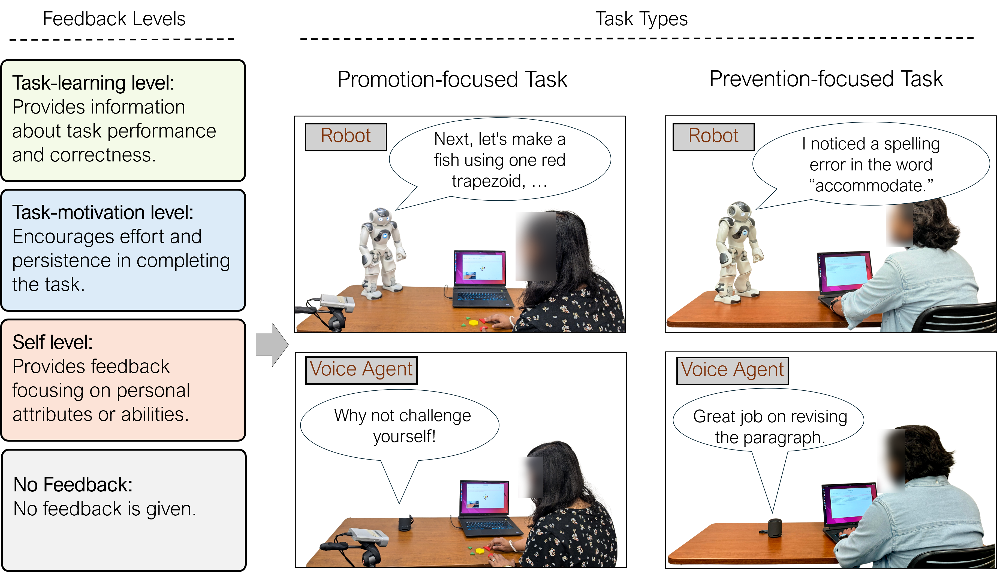

[**Code**](https://github.com/robot-feedback/feedback-impact/tree/main/code)
| [**LLM Prompt**](https://github.com/robot-feedback/feedback-impact/tree/main/llm_prompt/)
| [**Feedback Data**](https://github.com/robot-feedback/feedback-impact/tree/main/generated_feedback/)
| [**User Study Questionnares**](https://github.com/robot-feedback/feedback-impact/tree/main/supplementary_files)

# Impact of Adaptive Robot Feedback on Human Task Performance

## Overview
This work investigates how adaptive robot feedback—powered by large language models (LLMs)—influences human task performance and perception across different task types and agent embodiments. The study examines how feedback at different levels (task-learning, task-motivation, and self-level) interacts with promotion- and prevention-focused tasks when delivered by a robot or a voice agent.

## Study Design
- **Participants:** 32
- **Tasks:** 
  - Promotion-focused: Creative shape design
  - Prevention-focused: Error detection
- **Agents:** NAO humanoid robot and voice agent
- **Feedback Levels:** Task-learning, Task-motivation, Self, and No feedback
- **Feedback Generation:** Real-time adaptive responses using GPT-4o-mini based on Feedback Intervention Theory

## Key Findings
- Task-learning feedback significantly improved performance in creative (promotion-focused) tasks, especially when delivered by the robot agent.
- Voice agents performed better in error detection (prevention-focused) tasks due to reduced distraction.
- Robot agents were perceived as more anthropomorphic and engaging but could be distracting in detailed, prevention-focused tasks.

## Insights
- The effectiveness of feedback depends on feedback level, task characteristics, and agent embodiment.
- Task-learning feedback consistently enhances both objective performance and perceived usefulness.
- Embodied robots boost engagement but may hinder accuracy in detailed, prevention-focused tasks.