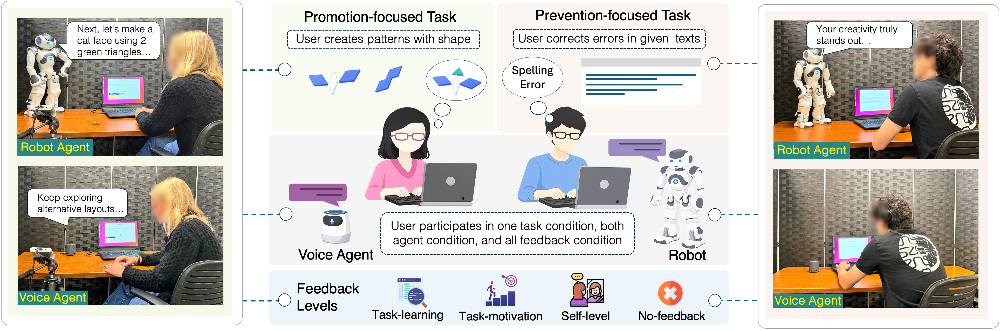
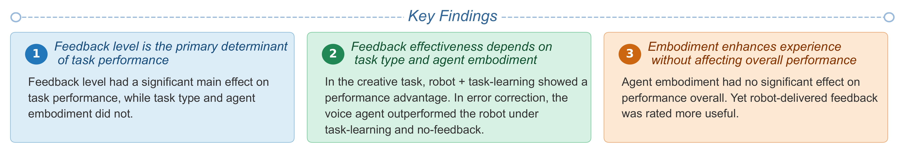

[**Code**](https://github.com/robot-feedback/feedback-impact/tree/main/code)
| [**LLM Prompt**](https://github.com/robot-feedback/feedback-impact/tree/main/llm_prompt/)
| [**User Study Questionnares**](https://github.com/robot-feedback/feedback-impact/tree/main/supplementary_files)

# Impact of Adaptive Feedback in Multimodal Human-Agent Interaction

## Overview
This project investigates how adaptive feedback, powered by large language models (LLMs)- influences human task performance and perception across different task types and agent embodiments.
We explore how varying feedback levels (task-learning, task-motivation, self-level and no feedback) interact with promotion- vs. prevention-focused tasks and robot agent vs. voice agents to shape user outcomes in Human-Agent Interaction (HAI).

## Methodology
- **Participants:** 40  
- **Design:** Mixed-factorial Study
    - **Between-subject factor:** Task type (2)
    - **Within-subject factors:** Agent embodiment (2) and feedback levels (4)
- **Tasks:** Creative shape design (promotion-focused) & error detection (prevention-focused)
- **Agents:** NAO robot and voice agent
- **Feedback Levels:** Task-learning, Task-motivation, Self, and No Feedback  
- **Feedback Generation:** Real-time, LLM-powered adaptive responses using `GPT-4o-mini` following Feedback Intervention Theory (FIT)

